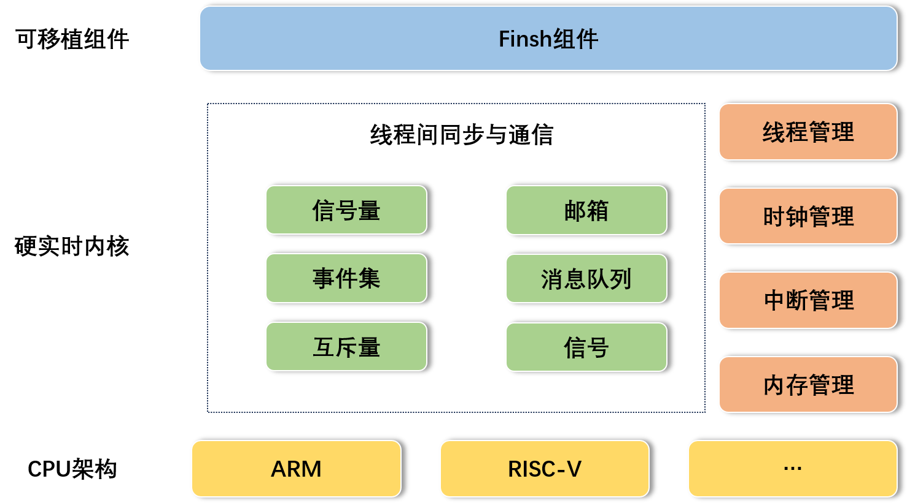

# RT-Thread Nano 简介

RT-Thread Nano 是一个极简版的硬实时内核，它是由 C 语言开发，采用面向对象的编程思维，具有良好的代码风格，是一款可裁剪的、抢占式实时多任务的 RTOS。其内存资源占用极小，功能包括任务处理、软件定时器、信号量、邮箱和实时调度等相对完整的实时操作系统特性。适用于家电、消费电子、医疗设备、工控等领域大量使用的 32 位 ARM 入门级 MCU 的场合。

下图是 RT-Thread Nano 的软件框图，包含支持的 CPU 架构与内核源码，还有可拆卸的 FinSH 组件：



**支持架构**：ARM：Cortex M0/ M3/ M4/ M7 等、RISC-V 及其他。

**功能**：线程管理、线程间同步与通信、时钟管理、中断管理、内存管理。

## Nano 的特点

### 简单

**1、下载简单**

RT-Thread Nano 以软件包的方式集成在 Keil MDK 与 CubeMX 中，可以直接在软件中下载 Nano 软件包获取源码，获取方式详见 [使用 KEIL MDK 移植 RT-Thread Nano](nano-port-keil/nano-port-keil.md) 与 [使用 CubeMX 移植 RT-Thread Nano](nano-port-cube/nano-port-cube.md) 。

同时也提供 [下载 Nano 源码压缩包]() 的途径，方便在其他开发环境移植 RT-Thread Nano，如 [使用 IAR 移植 RT-Thread Nano](nano-port-iar/nano-port-iar.md)。

**2、代码简单**

与 RT-Thread 完整版不同的是，Nano 不含 Scons 构建系统，不需要 Kconfig 以及 Env 配置工具，也去除了完整版特有的 device 框架和组件，仅是一个纯净的内核。

**3、移植简单**

由于 Nano 的极简特性，使 Nano 的移植过程变得极为简单。添加 Nano 源码到工程，就已完成 90% 的移植工作。并且在 Keil MDK 与 Cube MX 中还提供了 Nano 的软件包，可以一键下载加入到工程。以下是使用不同开发环境时，可以选择移植 Nano 的方法：

- [使用 KEIL MDK 移植 RT-Thread Nano](nano-port-keil/nano-port-keil.md)
- [使用 CubeMX 移植 RT-Thread Nano](nano-port-cube/nano-port-cube.md)
- [使用 IAR 移植 RT-Thread Nano](nano-port-iar/nano-port-iar.md)
- [移植 RT-Thread Nano 到 RISC-V](nano-port-gcc-riscv/nano-port-gcc-riscv.md) 

**4、使用简单**

RT-Thread Nano 在使用上也非常简单，带给开发者友好的开发体验。

- 易裁剪：Nano 的配置文件为 rtconfig.h，该文件中列出了内核中的所有宏定义，有些默认没有打开，如需使用，打开即可。具体的配置可见 Nano 版块的 [RT-Thread Nano 配置](nano-config/nano-config.md) 教程。
- 易添加 FinSH 组件：[FinSH 组件](../../programming-manual/finsh/finsh.md) 可以很方便的在 Nano 上进行移植，而不再依赖 device 框架，只需要对接两个必要的函数即可完成 [FinSH 移植](finsh-port/finsh-port.md)。
- 自选驱动库：可以使用厂商提供的固件驱动库，如 ST 的 STD 库、HAL 库、LL 库等，可以自行选择。
- 完善的文档：包含 [内核基础](../../programming-manual/basic/basic.md)、[线程管理 (例程)](../../programming-manual/thread/thread.md)、[时钟管理 (例程)](../../programming-manual/timer/timer.md)、[线程间同步 (例程)](../../programming-manual/ipc1/ipc1.md)、[线程间通信 (例程)](../../programming-manual/ipc2/ipc2.md)、[内存管理 (例程)](../../programming-manual/memory/memory.md)、[中断管理](../../programming-manual/interrupt/interrupt.md) ，以及 Nano 版块的移植教程。

### 小巧

**资源占用小**：对 RAM 与 ROM 的开销非常小，在支持 semaphore 和 mailbox 特性，并运行两个线程 (main 线程 + idle 线程) 情况下，ROM 和 RAM 依然保持着极小的尺寸，RAM 占用约 1K 左右，ROM 占用 4K 左右。

Nano 资源占用情况举例：在运行两个线程 (main 线程 + idle 线程) 情况下，ROM 和 RAM 依然保持着极小的尺寸。以下是基于 Cortex M3 的 MDK 工程编译结果（优化等级 3）。

```
    Total RO  Size (Code + RO Data)                 4000 (   3.91kB)
    Total RW  Size (RW Data + ZI Data)              1168 (   1.14kB)
    Total ROM Size (Code + RO Data + RW Data)       4092 (   4.00kB)
```

> 注：如果需要丰富的组件、驱动以及软件包等功能，则建议使用 [RT-Thread 完整版](../../index.md)。

### 开源免费（Apache 2.0）

RT-Thread Nano 实时操作系统遵循 Apache 许可证 2.0 版本，实时操作系统内核及所有开源组件可以免费在商业产品中使用，不需要公布应用程序源码，没有潜在商业风险。

